Cortar los cables

Wifimanager

# INSTRUCCIONES DE MONTAJE, PROGRAMACIÓN, PUESTA EN MARCHA Y ACTUALIZACIÓN

- [1 ¿Qué es RESPIRA?](#1-qué-es-respira)
- [2 Componentes Hardware](#2-listado-de-componentes-hardware)
- [3 Componentes Software](#3-Software)
- [Capítulo 4: Créditos](#capítulo-4-créditos)

# 1 ¿Qué es RESPIRA?

RESPIRA es una solución tecnológica IoT de código abierto compuesta por estaciones de medición de calidad del aire y por una plataforma web en la que se recogen y analizan las diferentes valoraciones sobre el estado del aire que respiramos, permitiendo así estudiar sus evoluciones a lo largo del tiempo con el fin de observar posibles procesos climáticos en nuestro territorio.
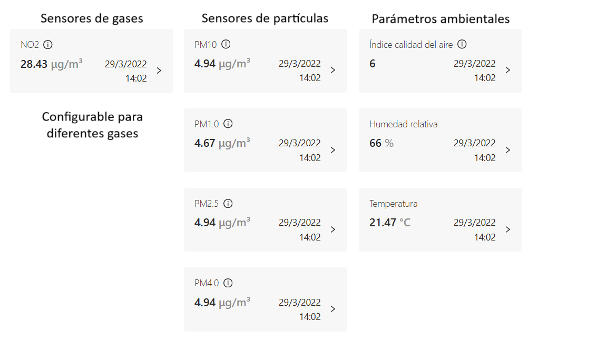

Cualquiera puede construir su propia estación RESPIRA siguiendo las indicaciones de este documento y puede conectarla a la plataforma del proyecto para transmitir vía WiFi los datos de su ubicación y ambientales.

Esta novedosa plataforma permite además que un sinfín de dispositivos que midan parámetros ambientales puedan sumarse, conectarse y compartir sus resultados con la comunidad.

Puede encontrar la plataforma en http://www.calidadmedioambiental.org/
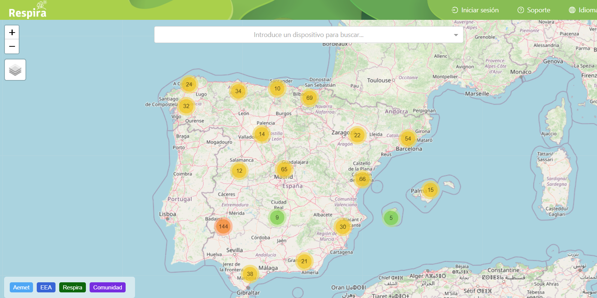
En ella se muestran sensores medioambientales, no solamente proporcionados por los usuarios de RESPIRA, sino también procedentes de otras fuentes de datos.
La plataforma muestra información de todas las estaciones registradas. Acercando el detalle de la imagen puede conocerse el detalle de las mediciones de una estación concreta.
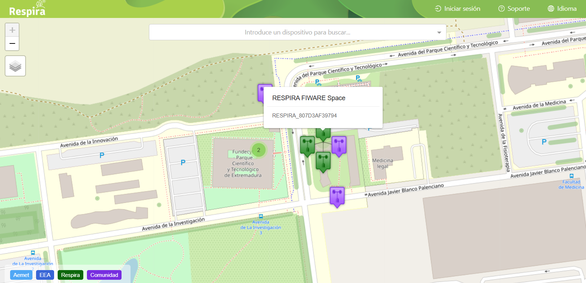
Siendo fieles a los principios de compartición de la filosofía Open Data, los datos sobre la calidad medioambiental generados por toda esta red de estaciones de medición (RESPIRA, AEMET, EEA, o cualquier otro que se incorpore), quedan disponibles en una plataforma web abierta para que quienes estén interesados puedan usarlos a su antojo pero, sobre todo, para que todo el mundo tenga acceso a una información fiable y actualizada sobre la calidad ambiental de su pueblo o ciudad.

# 2 Componentes Hardware

# 2.1 Microcontrolador ESP32 
|                         |                      |
|------------------------------|----------------------------------|
| 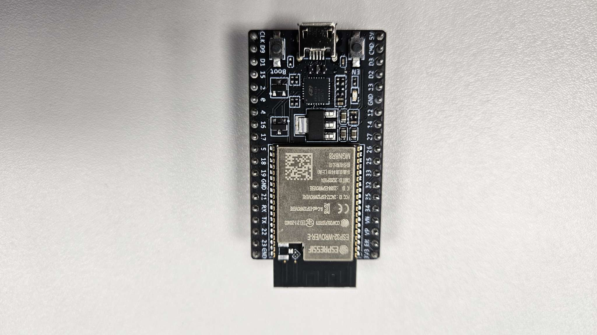        |Constituye el cerebro de la estación meteorológica.Contiene la programación específica de la estación, y recibe los datos de los sensores, que adapta y prepara para su envío a la plataforma.        |

Los sensores son cableados a los pines adecuados que por programa son asociados a las variables a transmitir.

El chip muestra 38 pines con diferentes funciones. Los pines GND y VCC 5V, VCC 3.3v proporcionan la alimentación para los sensores.

Además de pines con funciones específicas, existen pines analógicos, digitales de entrada, salida, o configurables como entrada o salida por programa. La programación "escucha" los pines de entrada, que pueden proporcionar valores digitales 1 o 0 (HIGH/LOW), o analógicos.

Estas entradas pueden llegar desde interruptores, pulsadores, o sensores. 

En este conjunto no existe comandado, pero pines configurados como salida pueden enviar a actuadores señales de encendido o de control, directamente, o a través de chips que interpretan la señal, como los drivers de motores.   

## 2.2 Placa de desarrollo
|                         |                      |
|------------------------------|----------------------------------|
| 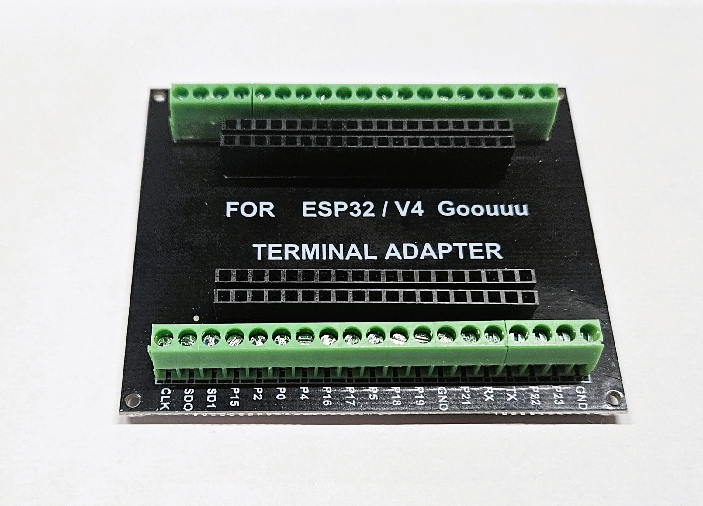       |Placa de adaptación para permitir el atornillado en bornas       |

El microcontrolador muestra 38 pines macho para la conexión de dispositivos mediante, por ejemplo, conectores Dupont.
Con el fin de evitar la liberación inesperada del cableado, resulta más eficaz utilizar bornas atornilladas sobre el cableado.
Para ello se utiliza esta placa de desarrollo, en la cual se encastra el microcontrolador insertando sus pines en los zócalos adecuados.
Cada borna para atornillar muestra un texto serigrafiado que se corresponde con un pin serigrafiado sobre el microcontrolador ESP32.
> [!CAUTION]
> Verificar que al orientar el chip los textos serigrafiados en chip y placa coinciden

> [!CAUTION]
> En algunas placas de desarrollo aparece como GND una borna incorrectamente. En realidad se corresponde con CMD en el chip, y NO debe utilizarse como Ground.

## 2.3 Sensor de Temperatura y Humedad
|                         |                      |
|------------------------------|----------------------------------|
| 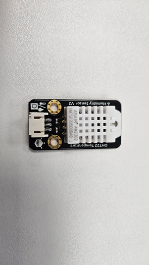       |  El sensor DHT22 es muy conocido en el mundo maker, permite obtener con facilidad ambos valores ambientales. Se presenta con un cable externo     |

## 2.4 Sensor de gases
|                         |                      |
|------------------------------|----------------------------------|
|  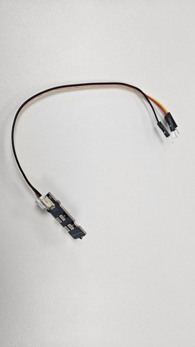       |  Permite detectar en el ambiente gases como CO2, CO, NO2.     |

## 2.5 Sensor de partículas
|                         |                      |
|------------------------------|----------------------------------|
| 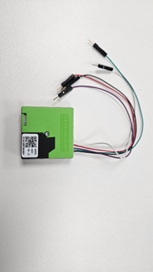       |    Proporciona información PM (Particule Matter) acerca del tamaño de las partículas en suspensión en el aire. La medición de la presencia de partículas se realiza en función de su diámetro expresado en micrómetros, usando denominaciones como PM1, PM2.5, PM10.  |

Las partículas en suspensión (total de partículas suspendidas: TPS) (o material particulado (PM)) son mezclas de partículas sólidas o líquidas dispersas en la atmósfera y que se caracterizan por su pequeño tamaño que hace que permanezcan en suspensión estacionaria en el aire durante periodos largos de tiempo, que pueden variar de unas pocas horas a varios meses e incluso años.

 Su presencia en el aire puede ser debida a causas naturales (huracanes, actividad volcánica, etcétera) o de origen antropogénico, es decir, como consecuencia de la actividad humana (explotación de canteras, quema de combustibles, tráfico, entre otras). 
 
 Fuente: https://es.wikipedia.org/wiki/Part%C3%ADculas_en_suspensi%C3%B3n
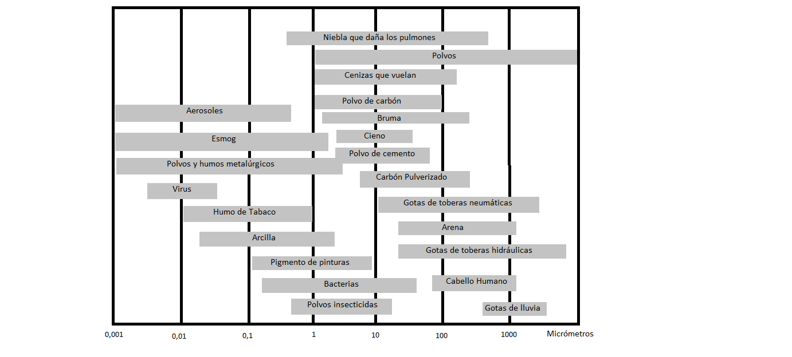 

El sensor de partículas se presenta en un formato compacto con 5 cables.

## 2.6 Carcasa principal
|                         |                      |
|------------------------------|----------------------------------|
|        |    Como parte del proyecto, ha sido diseñada e impresa en 3D una carcasa con ranuras de ventilación y una placa interna de apoyo para los componentes. Se complementa con tapas de metacrilato que permiten ver el interior   |

## 2.7 Soporte de componentes
|                         |                      |
|------------------------------|----------------------------------|
|  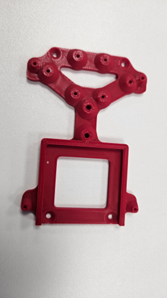    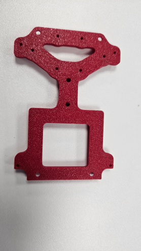 | Insertado en la carcasa y con perforaciones para atornillar los componentes.  Permite fijar el conjunto de manera sólida   |

# 3 Componentes Software
## Necesidades
- ArduinoIDE
- Librería de código para sensor de gases
- Librería de código para sensor de Temperatura y Humedad
- Librería de código para sensor de partículas
- Aplicación RESPIRA para Arduino
Conexionado

# CONECTAR A WIFI
La aplicación incluye WIFIManager, un 
