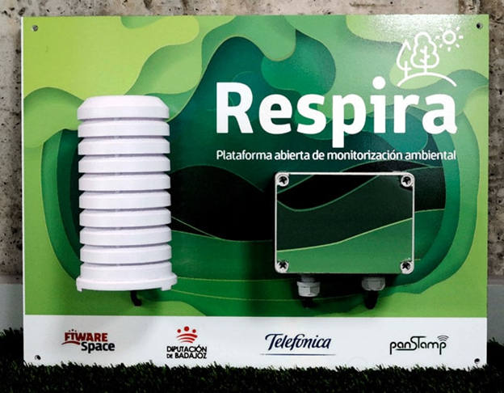

Cortar los cables
Wifimanager

# Respira
# INSTRUCCIONES DE MONTAJE, PROGRAMACIÓN, PUESTA EN MARCHA Y ACTUALIZACIÓN

# ¿Qué es RESPIRA?

# LISTADO DE COMPONENTES HARDWARE

| Imagen                        | Descripción                     |
|------------------------------|----------------------------------|
|         |Constituye el cerebro de la estación meteorológica.Contiene la programación específica de la estación, y recibe los datos de los sensores, que adapta y prepara para su envío a la plataforma

Los sensores son cableados a los pines adecuados que por programa son asociados a las variables a transmitir.

El chip muestra 38 pines con diferentes funciones. Los pines GND y VCC 5V, VCC 3.3v proporcionan la alimentación para los sensores.
Además de pines con funciones específicas, existen pines analógicos, digitales de entrada, salida, o configurables como entrada o salida por programa.
La programación "escucha" los pines de entrada, que pueden proporcionar valores digitales 1 o 0 (HIGH/LOW), o analógicos. Estas entradas pueden llegar desde interruptores, pulsadores, o sensores.
En este conjunto, no existe comandado, pero pines configurados como salida pueden enviar a actuadores señales de encendido o de control, directamente, o a través de chips que interpretan la señal, como los drivers de motores.           |
|         | Texto descriptivo 2             |
|         | Texto descriptivo 3             |
|         | Texto descriptivo 4             |

## 2 Placa de desarrollo

El microcontrolador muestra 38 pines macho para la conexión de dispositivos mediante, por ejemplo, conectores Dupont.
Con el fin de evitar la liberación inesperada del cableado, resulta más eficaz utilizar bornas atornilladas sobre el cableado.
Para ello se utiliza esta placa de desarrollo, en la cual se encastra el microcontrolador insertando sus pines en los zócalos adecuados.
Cada borna para atornillar muestra un texto serigrafiado que se corresponde con un pin serigrafiado sobre el microcontrolador ESP32.
> [!CAUTION]
> Verificar que al orientar el chip los textos serigrafiados en chip y placa coinciden

> [!CAUTION]
> En algunas placas de desarrollo aparece como GND una borna incorrectamente. En realidad se corresponde con CMD en el chip, y NO debe utilizarse como Ground.

## 3 Sensor de Temperatura y Humedad
El sensor DHT22 es muy conocido en el mundo maker, permite obtener con facilidad ambos valores ambientales

Se presenta con un cable externo

## 4 Sensor de gases
Permite detectar en el ambiente gases como CO2, CO, NO2.

## 5 Sensor de partículas
Proporciona información PM (Particule Matter) acerca del tamaño de las partículas en suspensión en el aire.
Las partículas en suspensión (total de partículas suspendidas: TPS) (o material particulado (PM)) son mezclas de partículas sólidas o líquidas dispersas en la atmósfera y que se caracterizan por su pequeño tamaño que hace que permanezcan en suspensión estacionaria en el aire durante periodos largos de tiempo, que pueden variar de unas pocas horas a varios meses e incluso años. Su presencia en el aire puede ser debida a causas naturales (huracanes, actividad volcánica, etcétera) o de origen antropogénico, es decir, como consecuencia de la actividad humana (explotación de canteras, quema de combustibles, tráfico, entre otras). Fuente: https://es.wikipedia.org/wiki/Part%C3%ADculas_en_suspensi%C3%B3n
La medición de la presencia de partículas se realiza en función de su diámetro expresado en micrómetros, usando denominaciones como PM1, PM2.5, PM10.
 Fuente: https://es.wikipedia.org/wiki/Part%C3%ADculas_en_suspensi%C3%B3n

El sensor de partículas se presenta en un formato compacto con 5 cables.

## 6 Carcasa principal
Como parte del proyecto, ha sido diseñada e impresa en 3D una carcasa con ranuras de ventilación y una placa interna de apoyo para los componentes. Se complementa con tapas de metacrilato que permiten ver el interior

## 7 Soporte de componentes
Insertado en la carcasa y con agujeros para atornillar los componentes.

# CONECTAR A WIFI
La aplicación incluye WIFIManager, un 

